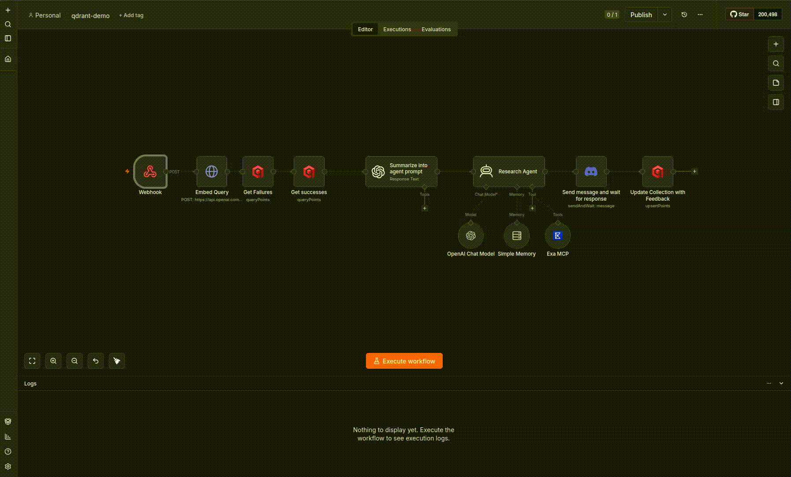

# n8n Discord Bot

A Discord bot that relays mentions to an [n8n](https://n8n.io/) workflow via webhook, so an n8n agent can process the request and reply asynchronously. Qdrant is used as the backing store for the workflow's context.

## How it works

1. The bot listens for messages that mention it.
2. On a mention, it reacts with 👀, acknowledges the request with a tracking ID, and `POST`s the message content to an n8n webhook (`{"message", "mention", "request_id"}`), authenticated with an `x-api-key` header.
3. The n8n workflow takes it from there (e.g. querying/updating the Qdrant collection created by this project) and reports back to the channel itself.



## Requirements

- Python >= 3.14
- [uv](https://docs.astral.sh/uv/)
- A Discord bot token
- A running n8n instance with a webhook-triggered workflow
- A Qdrant instance (Cloud or self-hosted)

## Setup

1. Install dependencies:

   ```bash
   uv sync
   ```

2. Get a Discord bot token:

   1. Go to the [Discord Developer Portal](https://discord.com/developers/applications) and click **New Application**, then give it a name.
   2. Open the **Bot** tab and click **Reset Token** (or **Add Bot**, on an app that doesn't have one yet) to reveal and copy the token. Keep it secret — treat it like a password.
   3. On the same tab, enable the **Message Content Intent** under **Privileged Gateway Intents** (the bot needs it to read message text).
   4. Go to **OAuth2 → URL Generator**, check the `bot` scope, and under **Bot Permissions** select at least `Send Messages`, `Read Message History`, and `Add Reactions`.
   5. Open the generated URL and invite the bot to your server.

3. Import the example n8n workflow:

   This repo ships [`n8n-workflow.json`](./n8n-workflow.json), a ready-made workflow that pairs with this bot. It receives the webhook call, embeds the query and checks Qdrant for similar past successes/failures, runs a research agent (OpenAI + Exa web search) informed by that history, posts the answer back to Discord with a feedback form, and stores the outcome in Qdrant for next time.

   In your n8n instance, go to **Workflows → Import from File** and select `n8n-workflow.json`. Then:

   1. Reassign the credentials on each node (OpenAI, Exa, Discord, Qdrant) to your own accounts.
   2. Create a **Header Auth** credential (name: `x-api-key`, value: a secret of your choice) and assign it to the **Webhook** node. The same secret is your `N8N_WEBHOOK_AUTH_KEY`.
   3. Activate the workflow and copy its **Webhook** node's production URL — this is your `N8N_WEBHOOK_ENDPOINT`.

4. Create a `.env` file in the project root with:

   ```bash
   DISCORD_BOT_TOKEN=your-discord-bot-token
   N8N_WEBHOOK_ENDPOINT=https://your-n8n-instance/webhook/your-id
   N8N_WEBHOOK_AUTH_KEY=your-webhook-header-auth-secret
   QDRANT_URL=https://your-qdrant-instance
   QDRANT_API_KEY=your-qdrant-api-key   # optional, if your instance requires it
   ```

5. Create the Qdrant collection the bot expects (`n8n-bot`, 1536-dim cosine vectors, with `feedback` and `success` payload indexes):

   ```bash
   uv run n8n-qdrant-collection
   ```

6. Run the bot:

   ```bash
   uv run n8n-discord-bot
   ```
